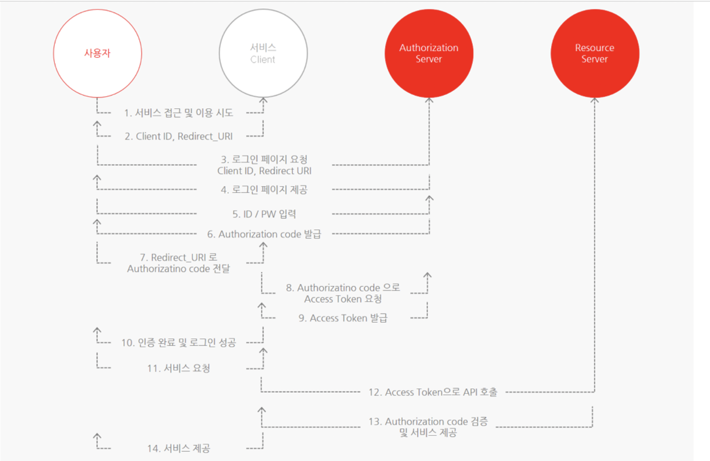

# TIL 2021 - 08 - 02  📖 !

- sprint

1. OAuth의 작동 방식을 이해할 수 있다.

- OAuth 란?

  OAuth2.0은 인증을 위한 표준 프로토콜의 한 종류
  보안 된 리소스에 액세스하기 위해 클라이언트에게 권한을 제공(Authorization)하는 프로세스를 단순화하는 프로토콜 중 한 방법입니다.

 - OAuth 는 언제, 왜 쓸까요?

    유저 입장에서 생각해보자면, 우리는 웹상에서 굉장히 많은 서비스를 이용하고 있고 각각의 서비스들을 이용하기 위해서는 회원가입 절차가 필요한 경우가 대부분입니다. 그 서비스별로 ID와 Password를 다 기억하는 것은 매우 귀찮은 일입니다. OAuth 를 활용한다면 자주 사용하고 중요한 서비스들(예를 들어 google, github, facebook) 의 ID와 Password만 기억해 놓고 해당 서비스들을 통해서 소셜 로그인을 할 수 있습니다.

    뿐만 아니라 OAuth는 보안상의 이점도 있습니다.  검증되지 않은 App에서 OAuth를 사용하여 로그인한다면, 직접 유저의 민감한 정보가 App에 노출될 일이 없고 인증 권한에 대한 허가를 미리 유저에게 구해야 하기 때문에 더 안전하게 사용할 수 있습니다.

- Auth에서 꼭 알아야 할 용어

   - Resource Owner :  액세스 중인 리소스의 유저입니다. 김코딩의 구글 계정을 이용하여 App에 로그인할 경우, 이때 Resource owner은 김코딩이 됩니다.

   - Client :  Resource owner를 대신하여 보호된 리소스에 액세스하는 응용프로그램입니다. 클라이언트는 서버, 데스크탑, 모바일 또는 기타 장치에서 호스팅할 수 있습니다.

    - Resource server :  client의 요청을 수락하고 응답할 수 있는 서버입니다.

    - Authorization server :  Resource server가 액세스 토큰을 발급받는 서버입니다. 즉 클라이언트 및 리소스 소유자를 성공적으로 인증한 후 액세스 토큰을 발급하는 서버를 말합니다.

    - Authorization grant :  클라이언트가 액세스 토큰을 얻을 때 사용하는 자격 증명의 유형입니다.

    - Authorization code :  access token을 발급받기 전에 필요한 code 입니다. client ID로 이 code를 받아온 후, client secret과 code를 이용해 Access token 을 받아옵니다.

    - Access token :  보호된 리소스에 액세스하는 데 사용되는 credentials입니다. Authorization code와 client secret을 이용해 받아온 이 Access token으로 이제 resource server에 접근을 할 수 있습니다.
    
    - Scope :  scope는 토큰의 권한을 정의합니다. 주어진 액세스 토큰을 사용하여 액세스할 수 있는 리소스의 범위입니다.

2. 직접 OAuth로 로그인 가능한 어플리케이션을 제작할 수 있다.

3. Authentication과 Authorization의 차이를 이해할 수 있다.
   - 인증(Authentication)과 인가(Authorization)로볼 수 있다 . 인증과 인가는 간혹 혼동이 올 수 있지만 인증을 거친 후 인증된 사용자에 대한 특정한 권한을 부여하는걸 말한다 

      예를 들자면 콘서트에 간다고 생각해보자 
      나와 나와같이 간 일행은 티켓팅의 실패로 다른 등급의 좌석에 배정 받았다 이때 콘서트에 입장 할 수 있다는것은 동일하다
      나와 내 동행은 둘다 티켓이 있기 때문에 콘서트장에 들어 갈 수 있는 인증을 받은것이다 하지만 나는 R석의 티켓이고 동행은 S석의 티켓이기 때문에 나는 R석에 앉을 수 있는 권한을 얻은 것이고 동행은 S석에 앉을 수 있는 권한을 얻은것이다 만약 콘서트에 들어 갈 티켓이 없다면 콘서트에 들어가는 인증을 받지 못한것이고 그 말은 권한 조차 가질 수 없는것이다 .
      만약 스텐딩 석을 배정 받았다면 콘서트에 들어 갈 수 있는 인증은 있지만 자리에 앉을 권한은 받지 못한것이다 .

"브라우저" - "내 서버" - "인증 대행 서비스"간 요청/응답을 주고받는 다이어그램을 그릴 수 있다.

위와같이 나타 낼 수 있다 . 

OAuth의 키워드를 설명할 수 있다.
  - CSRF를 통한 계정 탈취

    OAuth를 통해 계정 연동을 진행할 경우 다음과 같은 다음과 유사한 프로세스를 거치게 됩니다.

 

    1. 기존 계정과 SNS 계정 연동 요청

    2. 요청 SNS 로그인 페이지 출력 (Client ID 값이     포함된 로그인 페이지)

    3. ID/PW 를 통해 SNS 계정에 로그인

    4. 로그인 성공 시 인증 서버로부터 
    Authorization     code를 발급 받음 (Authentication Server ->     사용자)

    5. 발급 받은 code 값과 state 값을 Client 서버로     전송 (사용자 -> Client Server) 6. code 값과     state 값 검증 후 Client 서버에 로그인 되어있는     계정과 SNS 계정이 연동됨

    이 때 state값은 CSRF token과 같은 역할을 하기 때문에 검증이 미흡할 경우 CSRF 공격을 통해 공격자의 계정으로 연동하는 등의 악의적인 행위가 발생할 수 있습니다. (공격자 SNS 계정으로 접속할 경우 피해자의 계정으로 로그인)

 
 
   - 대응 방안

state값은 CSRF token과 동일한 역할을 수행하므로, 요청받은 state에 대해 검증을 수행해야 하고 토큰의 유출 및 악용 방지를 위해 유효기간을 짧게 혹은 일회용으로 설정합

[출처](https://taesun1114.tistory.com/entry/OAuth-20)
