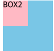
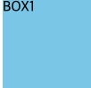
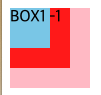
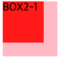

이번에는 CSS z-index속성에 대해 알아보려 합니다 !

- z-index를 사용하는 이유 ?
css를 작성하면서 내가 원하는 컨텐츠가 다른 컨텐츠 뒤에 가려져서
난감한 경우가 종종 있습니다
그런 경우를 해결하기 위해 사용하는 속성이 바로 z-index라는 속성입니다
z-index의 기본값은 auto 이고
보통 1, 9, 100, -1, -100등의 숫자로 그 속성의 값을 지정합니다
z-index의 가장 중요한 특징 중 하나는
아무 요소나 다 z-index를 넣는다고 해서 우선순위를 넣을 수 는 없다는 점이다.
z-index 속성이 적용되기 위해서는 
z-index를 적용한 영역이 position:static 값이 아니어야 합니다 예를 들면 

```js

<body>
    <div class="wrap">
       <div class="box1">BOX1</div>
       <div class="box2">BOX2</div>
    </div>
 </body>

 .wrap{
    position:relative;
}
.box1{
    background:skyblue; width:100px; height:100px; z-index:10;
}
.box2{
    position:absolute; 
    top:0; left:0; 
    background:pink; 
    width:50px; 
    height:50px; 
    z-index:1;
}
```
이렇게 되어 있는 경우에 z-index가 더 큰 box 1 이 우선으로 나와야 하지만 
아래의 이미지 처럼 box2가 위쪽에 있는걸 볼 수 있습니다 




그 이유가 바로 .box1에 position 값이 지정되어있지 않기 때문에
z-index 속성이 먹히지 않아서 입니다

이때 box1에 position relative를 주게되면 
```js
.box1{
    background:skyblue; 
    width:100px; 
    height:100px; 
    z-index:10;
    position: relative;
}
```



이와같이 box1이 위로 온것을 확인 할 수 있습니다 !

z-index의 가장 중요하면서 헷갈리기 쉬운 특징 중에 하나는
z-index의 비교 대상을 확인하는 것입니다

z-index는 같은 형제 요소에 선언된 z-index끼리 비교를 합니다.
만약 같은 형제 요소끼리에서 z-index가 선언된 내용이 없으면
자식 요소의 z-index값을 가지고 확인합니다.

위 내용을 예를 들면
```js
    <div class="wrap">
        <div class="box1">
           BOX1
        </div>
        <div class="box2">
           BOX2
           <div class="box2-1">BOX2-1</div>
        </div>
     </div>
     .wrap{position:relative;}
.box1{position:absolute;
     top:0; left:0; 
     background:skyblue; 
     width:40px; 
     height:40px; 
     z-index:10;
    }
.box2{
    position:absolute; 
    top:0; 
    left:0; 
    background:pink;
     width:80px; 
     height:80px; 
     z-index:1;
    }
.box2-1{
    position:absolute; 
    top:0; 
    left:0; 
    background:red; 
    width:60px; 
    height:60px; 
    z-index:999;
}
```

이와같이 z-index가 999인 box2-1이 제일 앞에 있어야 할 것 같지만 



아래와 같이 box1 이 위에 있는걸 확인 할 수 있습니다 

이는 .box1과 .box2 두 형제 요소끼리의 z-index 비교에서
이미 .box2영역이 z-index:1로 .box1의 z-index:10에서 밀리기 때문에
.box2 자식 요소로 있는 영역에 아무리 z-index를 많이 줘봤자
밀리게 됩니다.
원래 원하던대로 .box2-1를 가장 위쪽으로 위치하게 하기 위해선

.box2에 설정된 z-index:1; 을 제거하면 됩니다.


```js
.wrap{position:relative;}
.box1{position:absolute;
     top:0; left:0; 
     background:skyblue; 
     width:40px; 
     height:40px; 
     z-index:10;
    }
.box2{
    position:absolute; 
    top:0; 
    left:0; 
    background:pink;
     width:80px; 
     height:80px; 
    }
.box2-1{
    position:absolute; 
    top:0; 
    left:0; 
    background:red; 
    width:60px; 
    height:60px; 
    z-index:999;
}
```



아래와 같이 변한걸 볼 수 있습니다 ! 